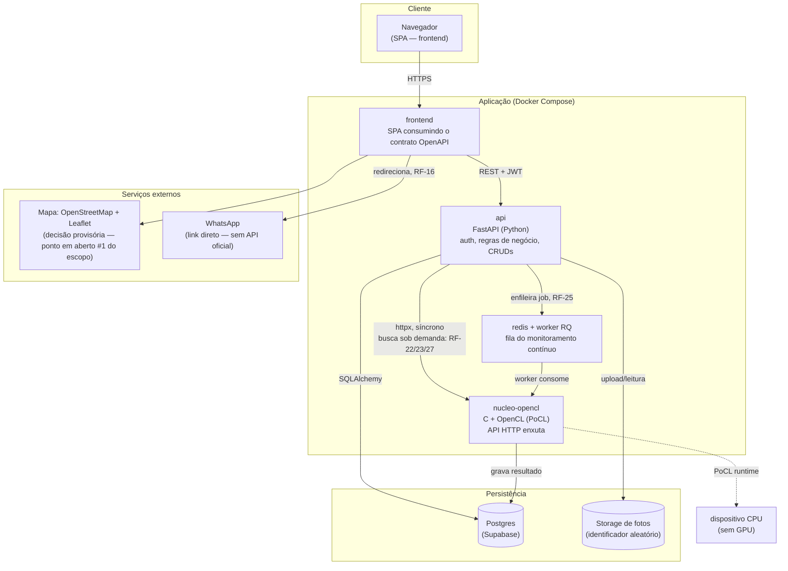
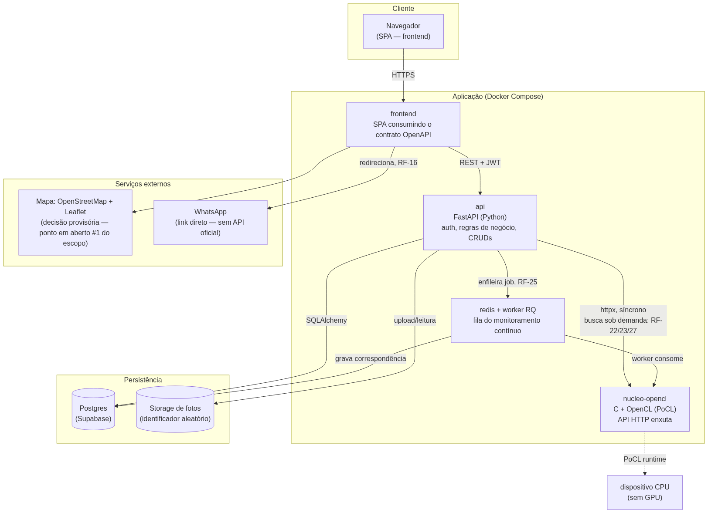
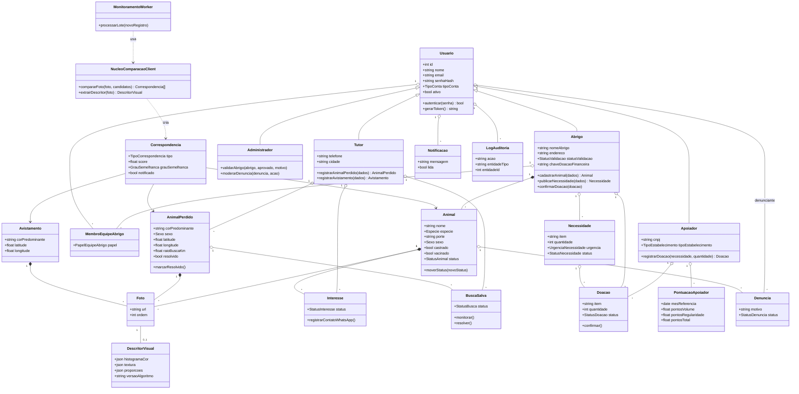
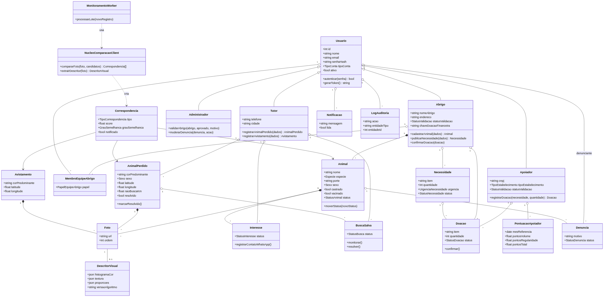

# Universidade Maurício de Nassau
### Curso de Ciência da Computação

# BuscaPet — Documento da Sprint 2

**Equipe:**
Kaian Guthierry da Silva — 01617843
Nivaldo José de Arruda Filho — 01486768
Marlon Porto Torres — 01611478

**Recife — 2026**

**Prazo de entrega: 19/09/2026** (adiado de 12/09 pela professora)

---

> ⚠️ **Antes de gerar o PDF final:** o roteiro exige um único arquivo contendo **todas as sprints anteriores + a atual**. Este arquivo cobre só a Sprint 2. Juntar, nesta ordem: (1) capa + conteúdo de `Buscapet Sprint1.pdf` (já está em `docs/`), (2) este documento convertido em PDF. Ferramentas possíveis: colar este Markdown no Google Docs/Word e exportar como PDF, ou uma extensão "Markdown PDF" no VS Code, e depois mesclar os dois PDFs (ferramenta online de merge, ou imprimir os dois como um único PDF). As imagens em `imagens/` já substituem os blocos Mermaid para quem for colar no Word.

---

## Sumário da Sprint 2

1. Arquitetura do sistema
2. Diagrama de classes
3. Modelo Entidade-Relacionamento (MER)
4. Modelo Relacional
5. Protótipo das telas principais
6. Banco de dados criado
7. Projeto estruturado no GitHub

---

# 1. Arquitetura do sistema

## 1.1 Visão geral

A plataforma é dividida em quatro componentes que se comunicam por HTTP, e
não em um monólito. A decisão mais importante da arquitetura é isolar o
núcleo de similaridade visual (o componente que atende a disciplina de
Tópicos Avançados) do backend web: eles são dois serviços separados, em
linguagens diferentes, falando entre si por uma API HTTP interna enxuta.





_Imagem gerada a partir do bloco Mermaid acima — usar esta versão ao colar no Word/Google Docs, que não renderizam Mermaid nativamente._

## 1.2 Componentes e tecnologias

| Componente | Tecnologia | Responsabilidade |
|---|---|---|
| `frontend` | SPA (framework a definir por Marlon — P3, ver [`frontend/README.md`](https://github.com/Equipe-BuscaPet/BuscaPet-App/blob/main/frontend/README.md) no repo de código) | Interface das telas descritas em [`descricao-paginas-fluxos-v1.md.pdf`](../../planejamento/descricao-paginas-fluxos-v1.md.pdf) |
| `api` | Python + FastAPI, SQLAlchemy 2.0 + Alembic, JWT (`python-jose`) | Autenticação e controle de acesso por perfil (RF-01 a RF-03), CRUDs de abrigo/animal/doação, orquestração das chamadas ao núcleo |
| `nucleo-opencl` | C (`cl.h`) + PoCL | Extração de descritores visuais, comparação em massa e benchmark comparativo (RF-21 a RF-23, RF-27, RF-29) |
| Fila (`redis` + worker RQ) | Redis + RQ (Python) | Processa o lote de monitoramento contínuo (RF-24, RF-25) sem bloquear requisições da API |
| Banco de dados | Postgres (Supabase, free tier, extensão PostGIS disponível) | Persistência relacional — ver `docs/schema.sql` |
| Storage de fotos | A definir (Supabase Storage é o candidato natural, já que o banco está lá) | Guarda os arquivos com identificador aleatório, sem expor dados do autor (escopo, seção 9) |
| Mapa | OpenStreetMap + Leaflet | Decisão tomada agora para poder fechar a arquitetura — resolve o ponto em aberto #1 do documento de escopo. Gratuito e sem cota que ameace o projeto |

## 1.3 Por que o núcleo é um serviço separado, e não uma função dentro do backend

1. **Runtime isolado.** O núcleo depende do PoCL, que precisa estar instalado no ambiente de execução. Isso não deve ser um requisito para quem só trabalha no backend web ou no frontend — motivo pelo qual o Docker Compose isola isso em um container próprio (ver `notas-tecnicas-devops-ia-v1.md.pdf`, seção 2).
2. **Medição isolada.** O benchmark comparativo com/sem OpenCL (RF-29, o argumento central do projeto para Tópicos Avançados) precisa rodar sem ruído de outras partes da aplicação competindo por CPU.
3. **Contrato fechado desde a Sprint 1.** A API do núcleo (`POST /comparar`, `POST /extrair-descritor`) foi definida como parte do contrato OpenAPI da Sprint 1, o que permitiu ao frontend e ao backend avançarem com dados simulados antes do núcleo existir de fato (Sprint 3).

## 1.4 Dois caminhos de chamada ao núcleo

- **Sob demanda** (RF-22, RF-23, RF-27): o usuário aciona uma busca (wizard "Perdi meu animal" / "Encontrei um animal") → API chama `nucleo-opencl` via `httpx` de forma síncrona → resultado volta na mesma requisição.
- **Em lote, assíncrono** (RF-24, RF-25, RF-26): todo novo registro (`Animal` ou `Avistamento`) dispara um job na fila Redis → um worker RQ consome o job, chama o núcleo comparando contra todas as `buscas_salvas` ativas, grava o resultado em `correspondencias` e cria `notificacoes` quando há semelhança relevante. Rodar isso fora do ciclo de requisição é o que sustenta a carga N×M crescente citada no escopo (seção 4.4) sem travar a API.

---

# 2. Diagrama de classes

Modelo de domínio do backend. `Usuario` concentra autenticação; os três
perfis de conta (`Tutor`, `Abrigo`, `Apoiador`) e o `Administrador` herdam
dele — no banco isso é implementado como tabelas separadas em relação 1:1
(table-per-type, ver seção 4), não como herança física, mas no código de
domínio a herança é a forma natural de expressar "todo perfil é um usuário".





_Imagem gerada a partir do bloco Mermaid acima — usar esta versão ao colar no Word/Google Docs, que não renderizam Mermaid nativamente._

## Notas sobre decisões de modelagem

- **`NucleoComparacaoClient` e `MonitoramentoWorker`** são classes de serviço do backend Python — não do núcleo em C. Elas encapsulam a chamada HTTP (`httpx`) ao serviço `nucleo-opencl`, mantendo o resto do domínio (Tutor, Abrigo etc.) sem nenhuma dependência direta de como o núcleo é implementado. Se o núcleo mudar de linguagem no futuro, só essas duas classes precisam mudar.
- **`Foto` é compartilhada por três donos possíveis** (`Animal`, `AnimalPerdido`, `Avistamento`) via associação polimórfica — o mesmo trade-off explicado na seção 3 (MER) e na seção 4 (modelo relacional): sem FK real de banco para `entidade_id`, a integridade é garantida no código de domínio.
- **`Correspondencia` é o registro central do reencontro**: toda vez que o núcleo encontra um match relevante — seja numa busca ativa do tutor, num alerta ao abrigo ou numa busca inversa — uma linha nasce aqui. Isso evita duplicar a lógica de "o que é um match" em três lugares diferentes do código.

---

# 3. Modelo Entidade-Relacionamento (MER)

Modelo conceitual completo, cobrindo RF-01 a RF-41. Correspondência 1:1 com
`docs/schema.sql` (modelo relacional) e com `api/app/models/` (SQLAlchemy).

```mermaid
erDiagram
    USUARIOS ||--o| TUTORES : "é um"
    USUARIOS ||--o| ABRIGOS : "é um"
    USUARIOS ||--o| APOIADORES : "é um"
    USUARIOS ||--o{ MEMBROS_EQUIPE_ABRIGO : integra
    ABRIGOS ||--o{ MEMBROS_EQUIPE_ABRIGO : tem

    ABRIGOS ||--o{ ANIMAIS : cadastra
    ANIMAIS ||--o{ INTERESSES : recebe
    TUTORES ||--o{ INTERESSES : demonstra
    ANIMAIS ||--o{ DENUNCIAS : "pode ter"
    USUARIOS ||--o{ DENUNCIAS : denuncia

    TUTORES ||--o{ ANIMAIS_PERDIDOS : registra
    USUARIOS ||--o{ AVISTAMENTOS : registra
    TUTORES ||--o{ BUSCAS_SALVAS : mantém
    ANIMAIS_PERDIDOS ||--o{ BUSCAS_SALVAS : "monitorada em"

    ANIMAIS_PERDIDOS ||--o{ CORRESPONDENCIAS : "pode gerar"
    ANIMAIS ||--o{ CORRESPONDENCIAS : "pode gerar"
    AVISTAMENTOS ||--o{ CORRESPONDENCIAS : "pode gerar"

    FOTOS ||--o| DESCRITORES_VISUAIS : gera

    ABRIGOS ||--o{ NECESSIDADES : publica
    NECESSIDADES ||--o{ DOACOES : recebe
    APOIADORES ||--o{ DOACOES : registra
    ABRIGOS ||--o{ DOACOES : recebe
    APOIADORES ||--o{ PONTUACOES_APOIADOR : acumula

    USUARIOS ||--o{ NOTIFICACOES : recebe
    USUARIOS ||--o{ LOGS_AUDITORIA : realiza

    USUARIOS {
        int id PK
        string nome
        string email UK
        string senha_hash
        string tipo_conta
        bool ativo
    }
    TUTORES {
        int usuario_id PK "FK -> usuarios.id"
        string telefone
        string cidade
    }
    ABRIGOS {
        int usuario_id PK "FK -> usuarios.id"
        string nome_abrigo
        string endereco
        float latitude
        float longitude
        string status_validacao
        int validado_por_id FK
    }
    MEMBROS_EQUIPE_ABRIGO {
        int id PK
        int abrigo_id FK
        int usuario_id FK
        string papel
    }
    APOIADORES {
        int usuario_id PK "FK -> usuarios.id"
        string cnpj UK
        string tipo_estabelecimento
        string status_validacao
    }
    ANIMAIS {
        int id PK
        int abrigo_id FK
        string nome
        string especie
        string porte
        string sexo
        bool castrado
        bool vacinado
        string status
    }
    FOTOS {
        int id PK
        string entidade_tipo "animal | animal_perdido | avistamento — sem FK real, ver 3.1"
        int entidade_id "sem FK real, ver 3.1"
        string url
        int ordem
    }
    INTERESSES {
        int id PK
        int animal_id FK
        int tutor_id FK
        string status
    }
    ANIMAIS_PERDIDOS {
        int id PK
        int tutor_id FK
        string cor_predominante
        string sexo
        float latitude
        float longitude
        float raio_busca_km
        bool resolvido
    }
    AVISTAMENTOS {
        int id PK
        int usuario_id FK
        string cor_predominante
        float latitude
        float longitude
    }
    DESCRITORES_VISUAIS {
        int id PK
        int foto_id FK "UK — 1 descritor por foto"
        text histograma_cor
        text textura
        text proporcoes
    }
    BUSCAS_SALVAS {
        int id PK
        int tutor_id FK
        int animal_perdido_id FK
        string status
    }
    CORRESPONDENCIAS {
        int id PK
        string tipo
        int animal_perdido_id FK "nullable"
        int animal_id FK "nullable"
        int avistamento_id FK "nullable"
        float score
        string grau_semelhanca
        bool notificado
    }
    NECESSIDADES {
        int id PK
        int abrigo_id FK
        string item
        int quantidade
        string urgencia
        string status
    }
    DOACOES {
        int id PK
        int apoiador_id FK
        int abrigo_id FK
        int necessidade_id FK "nullable"
        string item
        int quantidade
        string status
    }
    PONTUACOES_APOIADOR {
        int id PK
        int apoiador_id FK
        date mes_referencia
        float pontos_volume
        float pontos_regularidade
        float pontos_total
    }
    NOTIFICACOES {
        int id PK
        int usuario_id FK
        string mensagem
        bool lida
    }
    DENUNCIAS {
        int id PK
        int denunciante_id FK
        int animal_id FK
        string motivo
        string status
    }
    LOGS_AUDITORIA {
        int id PK
        int usuario_id FK
        string acao
        string entidade_tipo
        int entidade_id
    }
```




_Imagem gerada a partir do bloco Mermaid acima — usar esta versão ao colar no Word/Google Docs, que não renderizam Mermaid nativamente._

## 3.1 Decisões de modelagem que exigem explicação

**Contas por tipo (table-per-type), não uma tabela única com colunas opcionais.**
`USUARIOS` guarda só o que é comum a todo mundo (autenticação). `TUTORES`,
`ABRIGOS` e `APOIADORES` têm PK = FK para `usuarios.id`. Alternativa
descartada: uma tabela `usuarios` única com todas as colunas de todos os
perfis — geraria dezenas de colunas `NULL` para quem não é abrigo, por
exemplo, e dificultaria constraint de obrigatoriedade por perfil.

**`FOTOS` é uma associação polimórfica** — pertence a um `ANIMAIS`, um
`ANIMAIS_PERDIDOS` ou um `AVISTAMENTOS`, indicado por `entidade_tipo` +
`entidade_id`, sem chave estrangeira de banco de fato (não é possível uma FK
apontar para "uma dentre três tabelas" em SQL padrão). Alternativa
descartada: três tabelas quase idênticas (`FOTOS_ANIMAL`, `FOTOS_PERDIDO`,
`FOTOS_AVISTAMENTO`) — foi rejeitada porque a extração de descritores (RF-21)
processa foto por foto de forma idêntica não importa a origem, e triplicar a
tabela obrigaria triplicar essa lógica ou fazer três JOINs onde um bastaria.
A integridade referencial dessa coluna é garantida na camada de aplicação
(backend), não pelo banco — trade-off assumido conscientemente.

**`CORRESPONDENCIAS` centraliza os três gatilhos de match** (busca do tutor,
alerta ao abrigo, busca inversa — escopo, seção 4) numa única tabela, com as
três FKs de destino sendo opcionais (só uma é preenchida por linha, a
depender de `tipo`). Isso evita reimplementar "o que é um grau de
semelhança" três vezes.

**`PONTUACOES_APOIADOR` é uma tabela de cache/resumo**, não a fonte de
verdade (que são as linhas de `DOACOES` confirmadas). Existe para não
recalcular o ranking inteiro a cada requisição — é recalculada a cada
confirmação de doação, uma linha por apoiador por mês, permitindo os "dois
períodos" do escopo (destaque do mês = uma linha; acumulado do ano = soma
das linhas do ano).

---

# 4. Modelo Relacional

DDL completo em [`docs/schema.sql`](../schema.sql) (roda direto no SQL Editor
do Supabase) — espelhado nos models SQLAlchemy em `api/app/models/` e na
migration Alembic `api/alembic/versions/0001_initial_schema.py` (é essa
migration que efetivamente cria o banco, ver seção 6).

Resumo de tabelas, chaves primárias e estrangeiras:

| Tabela | PK | FKs | Observação |
|---|---|---|---|
| `usuarios` | `id` | `validado_por_id → usuarios.id` (via abrigos, ver abaixo) | Base de autenticação de todos os perfis |
| `tutores` | `usuario_id` | `usuario_id → usuarios.id` | PK = FK (1:1 com usuarios) |
| `abrigos` | `usuario_id` | `usuario_id → usuarios.id`, `validado_por_id → usuarios.id` | `status_validacao` controla RF-06 |
| `membros_equipe_abrigo` | `id` | `abrigo_id → abrigos.usuario_id`, `usuario_id → usuarios.id` | UNIQUE(`abrigo_id`,`usuario_id`) — RF equipe do abrigo |
| `apoiadores` | `usuario_id` | `usuario_id → usuarios.id` | `cnpj` UNIQUE |
| `animais` | `id` | `abrigo_id → abrigos.usuario_id` | — |
| `fotos` | `id` | nenhuma FK real (`entidade_tipo`+`entidade_id`) | associação polimórfica — ver justificativa na seção 3 (MER) |
| `interesses` | `id` | `animal_id → animais.id`, `tutor_id → tutores.usuario_id` | RF-16 |
| `animais_perdidos` | `id` | `tutor_id → tutores.usuario_id` | RF-19 |
| `avistamentos` | `id` | `usuario_id → usuarios.id` | RF-20 |
| `descritores_visuais` | `id` | `foto_id → fotos.id` (UNIQUE) | 1 descritor por foto — RF-21 |
| `buscas_salvas` | `id` | `tutor_id → tutores.usuario_id`, `animal_perdido_id → animais_perdidos.id` | RF-24 |
| `correspondencias` | `id` | `animal_perdido_id`, `animal_id`, `avistamento_id` (todas nullable, para `animais_perdidos`/`animais`/`avistamentos`) | RF-23, RF-25, RF-26, RF-27 |
| `necessidades` | `id` | `abrigo_id → abrigos.usuario_id` | RF-30 |
| `doacoes` | `id` | `apoiador_id → apoiadores.usuario_id`, `abrigo_id → abrigos.usuario_id`, `necessidade_id → necessidades.id` (nullable) | RF-31, RF-32 |
| `pontuacoes_apoiador` | `id` | `apoiador_id → apoiadores.usuario_id` | UNIQUE(`apoiador_id`,`mes_referencia`) — RF-33 |
| `notificacoes` | `id` | `usuario_id → usuarios.id` | RF-36 |
| `denuncias` | `id` | `denunciante_id → usuarios.id`, `animal_id → animais.id`, `resolvido_por_id → usuarios.id` | RF-41 |
| `logs_auditoria` | `id` | `usuario_id → usuarios.id` | RF-39 |

## Normalização

O modelo está em 3FN: nenhuma coluna não-chave depende de outra coluna
não-chave (ex.: `pontuacoes_apoiador` é uma tabela de cache separada, não
colunas de "pontos" espalhadas em `apoiadores`, justamente para não misturar
um dado derivado/recalculável com o dado de cadastro). A única quebra
deliberada de integridade referencial estrita é a de `fotos.entidade_id`,
documentada na seção 3.1 do MER.

## Índices além das chaves

- `ix_fotos_entidade` em `fotos (entidade_tipo, entidade_id)` — toda leitura de fotos de um animal/perdido/avistamento filtra por essas duas colunas.
- Índices de geolocalização (busca por raio no mapa, RF-07 a RF-11) ficam para quando o volume justificar — Supabase já tem PostGIS disponível se for necessário migrar `latitude`/`longitude` para um tipo `geography`. Ponto em aberto, não bloqueia a Sprint 2.

---

# 5. Protótipo das telas principais

**Protótipo em alta-fidelidade (Figma):** https://www.figma.com/design/hRa8GLWzc4vvVToGGQ4Zxe/Untitled?node-id=0-1
_(conferir se o link de compartilhamento está com permissão de visualização
pública antes de anexar ao documento final — por padrão arquivos Figma são
privados)_

Wireframe original (base para a versão no Figma) também salvo em
[`prototipo.html`](prototipo.html) (abrir localmente no navegador funciona
sem servidor).

## O que está coberto

| Tela | Requisitos |
|---|---|
| Autenticação (login único) | RF-02, escopo seção 2.1 |
| Cadastro — escolha de perfil | RF-01 |
| Início — mapa + lista sincronizada | RF-07, RF-08, RF-09 |
| Perfil do Abrigo | RF-12, RF-13, RF-14 |
| Detalhe do Animal (modal) | RF-15, RF-16 |
| Perdi meu animal (wizard, etapas 1 e 5) | RF-19, RF-21 a RF-23 |
| Quem apoia | RF-30, RF-33, RF-35 |

Cada tela no protótipo traz anotações marcadas **DOC** (já especificado no
escopo), **DOC parcial** (existe mas incompleto) ou **IDEIA** (decisão da
equipe, ainda não formalizada) — a mesma legenda usada em
`descricao-paginas-fluxos-v1.md.pdf`, para manter rastreabilidade entre o que
foi decidido e de onde veio a decisão.

## Por que wireframe em vez de alta-fidelidade agora

Nesta Sprint o objetivo é validar fluxo e organização de informação, não
identidade visual — decidir cor, tipografia e ilustração definitivas antes de
fechar os fluxos (principalmente os pontos em aberto do reencontro e do
perfil administrador, ainda os menos amadurecidos) seria retrabalho
garantido. O wireframe usa caixas rotuladas e hachurado no lugar de fotos
reais, mantendo o foco em: o que existe em cada tela, onde o usuário clica, e
o que abre em seguida.

## Próximo passo (fora da Sprint 2)

Quando os pontos em aberto de fluxo (seção "Descrição de páginas e fluxos" da
memória do projeto / `descricao-paginas-fluxos-v1.md.pdf`) forem fechados
pela equipe, refinar estas telas em alta-fidelidade — Figma ou outra
ferramenta — já com identidade visual do BuscaPet (a logo já existe, ver capa
do documento da Sprint 1).

---

# 6. Banco de dados criado

A estrutura inicial está implementada e pronta para ser aplicada — não em
dados fictícios prontos ainda (isso é trabalho de "gerador de dados de
teste", já previsto na Sprint 1 do plano de sprints), mas o schema completo
do modelo relacional da seção 4 já existe em duas formas equivalentes:

1. **Migration Alembic** (`api/alembic/versions/0001_initial_schema.py`) — a
   forma "de verdade" de criar o banco, com histórico versionado. Rodar:
   ```bash
   cd api
   pip install -r requirements.txt
   alembic upgrade head
   ```
2. **DDL direto** (`docs/schema.sql`) — mesma estrutura, para quem preferir
   colar direto no SQL Editor do Supabase sem passar por Python/Alembic.

## Onde o banco está hospedado

Decisão de DevOps (`notas-tecnicas-devops-ia-v1.md.pdf`, seção 3): **Supabase
free tier** (Postgres com PostGIS disponível). Atenção: o projeto Supabase
free pausa após 1 semana de inatividade — reativar pelo painel antes de cada
Sprint/apresentação é parte do checklist de entrega, não um imprevisto.

## O que falta (não é escopo da Sprint 2)

- Popular com dados de teste (abrigos, animais e fotos fictícias) — item já
  previsto no plano de sprints para a Sprint 1/2, responsabilidade de quem
  cuida do banco.
- Índices de performance além dos mínimos de integridade — só quando o
  volume justificar (ver seção 4, "Índices além das chaves").
- A extração de descritores visuais em si (RF-21) não roda ainda — a coluna
  e a tabela (`descritores_visuais`) existem, o algoritmo é trabalho do
  núcleo OpenCL na Sprint 3.

## Ambiente usado para gerar este material

Os artefatos desta Sprint (models, migration, DDL, docs) foram preparados
numa máquina sem Docker/Python instalados — por isso a migration não foi
executada neste ambiente. Cada integrante deve rodar `alembic upgrade head`
(ou aplicar `schema.sql` no Supabase) na própria máquina/ambiente do projeto
antes da apresentação, para poder mostrar o banco de fato criado.

---

# 7. Projeto estruturado no GitHub

Repositório: **https://github.com/Equipe-BuscaPet** _(link a confirmar pelo
Scrum Master — completar com a URL exata do repositório do projeto dentro da
organização antes de enviar o PDF final)_.

## Estrutura entregue nesta Sprint

```
buscapet/
  api/                    backend FastAPI — models, config, esqueleto de rotas, testes, Alembic
  nucleo-opencl/          serviço C/OpenCL — contrato de API definido, Dockerfile com PoCL, implementação na Sprint 3
  frontend/               a estruturar por Marlon (P3 — frontend/UX)
  docs/                   escopo, plano de sprints, fluxos de tela, notas técnicas e as entregas desta Sprint 2
  docker-compose.yml      orquestra os 5 serviços locais (frontend, api, nucleo-opencl, db, redis)
  .github/workflows/ci.yml   lint (ruff) + testes (pytest) a cada Pull Request
  CLAUDE.md               contexto do projeto para quem usa IA no desenvolvimento
  README.md
```

## Checklist de entrega (item 7 do roteiro)

- [x] Estrutura inicial de pastas
- [x] `README.md` com descrição do projeto
- [x] Modelos de banco, migration inicial e DDL versionados
- [x] Workflow de CI configurado
- [ ] Primeiro commit de cada integrante — **pendente**: fazer localmente e dar push (`git init`, `git add`, `git commit`, `git remote add origin <url>`, `git push -u origin main`) antes do prazo
- [ ] Repositório criado dentro da organização `Equipe-BuscaPet` no GitHub, se ainda não existir
- [ ] Link definitivo do repositório inserido neste documento antes de gerar o PDF final

## Nota sobre o ambiente de preparação

Este material foi montado localmente (sem `gh` autenticado nem Docker
disponíveis no ambiente de geração), então o `git init` e o push para o
GitHub precisam ser feitos por um integrante com acesso configurado. Os
arquivos já estão prontos em disco, faltando só a etapa de versionamento e
envio.

---

