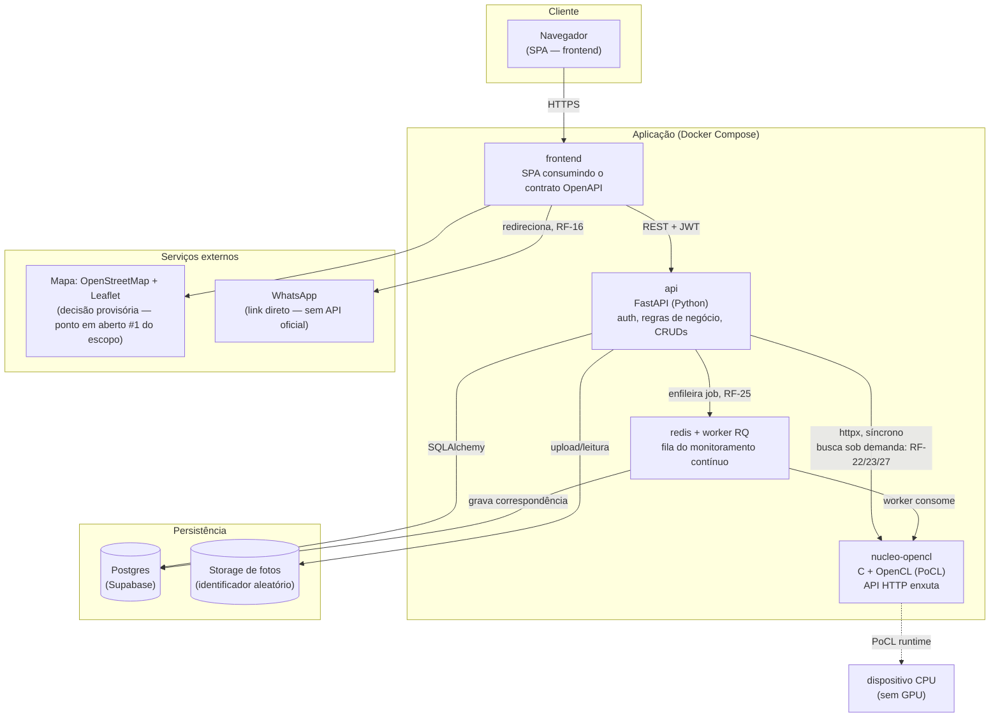

# 1. Arquitetura do sistema

## 1.1 Visão geral

A plataforma é dividida em quatro componentes que se comunicam por HTTP, e
não em um monólito. A decisão mais importante da arquitetura é isolar o
núcleo de similaridade visual (o componente que atende a disciplina de
Tópicos Avançados) do backend web: eles são dois serviços separados, em
linguagens diferentes, falando entre si por uma API HTTP interna enxuta.

_Imagem gerada a partir do bloco Mermaid acima — usar esta versão ao colar no Word/Google Docs, que não renderizam Mermaid nativamente._

> **Correção (revisão cruzada com o diagrama de classes e o MER):** a seta "grava resultado" saía do `nucleo-opencl` direto para o Postgres na versão anterior. Ela agora sai do **worker** (caminho assíncrono, RF-25), não do núcleo — mesma coisa no caminho síncrono, é a `api` que decide o que fazer com a resposta do núcleo. O núcleo recebe números e devolve números; se ele gravasse direto no banco, precisaria carregar conhecimento de domínio (o que é uma `Correspondencia`, um `Animal`), quebrando o isolamento que sustenta testar e medir o núcleo sozinho (RF-29).

## 1.2 Componentes e tecnologias

| Componente | Tecnologia | Responsabilidade |
|---|---|---|
| `frontend` | SPA (framework a definir por Marlon — P3, ver [`frontend/README.md`](https://github.com/Equipe-BuscaPet/BuscaPet-App/blob/main/frontend/README.md) no repo de código) | Interface das telas descritas em [`descricao-paginas-fluxos-v1.md.pdf`](../../planejamento/descricao-paginas-fluxos-v1.md.pdf) |
| `api` | Python + FastAPI, SQLAlchemy 2.0 + Alembic, JWT (`python-jose`) | Autenticação e controle de acesso por perfil (RF-01 a RF-03), CRUDs de abrigo/animal/doação, orquestração das chamadas ao núcleo |
| `nucleo-opencl` | C (`cl.h`) + PoCL | Extração de descritores visuais, comparação em massa e benchmark comparativo (RF-21 a RF-23, RF-27, RF-29) |
| Fila (`redis` + worker RQ) | Redis + RQ (Python) | Processa o lote de monitoramento contínuo (RF-24, RF-25) sem bloquear requisições da API |
| Banco de dados | Postgres (Supabase, free tier, extensão PostGIS disponível) | Persistência relacional — ver `docs/schema.sql` |
| Storage de fotos | A definir (Supabase Storage é o candidato natural, já que o banco está lá) | Guarda os arquivos com identificador aleatório, sem expor dados do autor (escopo, seção 9) |
| Mapa | OpenStreetMap + Leaflet | Decisão tomada agora para poder fechar a arquitetura — resolve o ponto em aberto #1 do documento de escopo. Gratuito e sem cota que ameace o projeto |

## 1.3 Por que o núcleo é um serviço separado, e não uma função dentro do backend

1. **Runtime isolado.** O núcleo depende do PoCL, que precisa estar instalado no ambiente de execução. Isso não deve ser um requisito para quem só trabalha no backend web ou no frontend — motivo pelo qual o Docker Compose isola isso em um container próprio (ver `notas-tecnicas-devops-ia-v1.md.pdf`, seção 2).
2. **Medição isolada.** O benchmark comparativo com/sem OpenCL (RF-29, o argumento central do projeto para Tópicos Avançados) precisa rodar sem ruído de outras partes da aplicação competindo por CPU.
3. **Contrato fechado desde a Sprint 1.** A API do núcleo (`POST /comparar`, `POST /extrair-descritor`) foi definida como parte do contrato OpenAPI da Sprint 1, o que permitiu ao frontend e ao backend avançarem com dados simulados antes do núcleo existir de fato (Sprint 3).

## 1.4 Dois caminhos de chamada ao núcleo

- **Sob demanda** (RF-22, RF-23, RF-27): o usuário aciona uma busca (wizard "Perdi meu animal" / "Encontrei um animal") → API chama `nucleo-opencl` via `httpx` de forma síncrona → resultado volta na mesma requisição.
- **Em lote, assíncrono** (RF-24, RF-25, RF-26): todo novo registro (`Animal` ou `Avistamento`) dispara um job na fila Redis → um worker RQ consome o job, chama o núcleo comparando contra todas as `buscas_salvas` ativas, grava o resultado em `correspondencias` e cria `notificacoes` quando há semelhança relevante. Rodar isso fora do ciclo de requisição é o que sustenta a carga N×M crescente citada no escopo (seção 4.4) sem travar a API.
