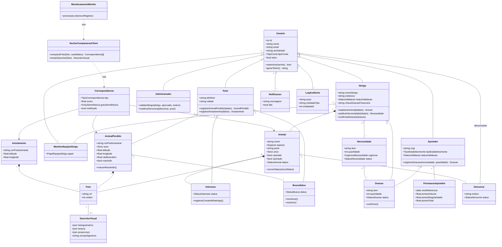

# 2. Diagrama de classes

Modelo de domínio do backend. `Usuario` concentra autenticação; os três
perfis de conta (`Tutor`, `Abrigo`, `Apoiador`) e o `Administrador` herdam
dele — no banco isso é implementado como tabelas separadas em relação 1:1
(table-per-type, ver seção 4), não como herança física, mas no código de
domínio a herança é a forma natural de expressar "todo perfil é um usuário".

_Imagem gerada a partir do bloco Mermaid acima — usar esta versão ao colar no Word/Google Docs, que não renderizam Mermaid nativamente._

## Notas sobre decisões de modelagem

- **`Apoiador` ganhou `statusValidacao`** (revisão cruzada com o MER, que já tinha `status_validacao` em `APOIADORES` — este diagrama estava um passo atrás). Faz sentido existir: é a validação leve de CNPJ discutida como alternativa à validação manual do abrigo (ponto em aberto #3 do escopo).
- **`NucleoComparacaoClient` e `MonitoramentoWorker`** são classes de serviço do backend Python — não do núcleo em C. Elas encapsulam a chamada HTTP (`httpx`) ao serviço `nucleo-opencl`, mantendo o resto do domínio (Tutor, Abrigo etc.) sem nenhuma dependência direta de como o núcleo é implementado. Se o núcleo mudar de linguagem no futuro, só essas duas classes precisam mudar.
- **`Foto` é compartilhada por três donos possíveis** (`Animal`, `AnimalPerdido`, `Avistamento`) via associação polimórfica — o mesmo trade-off explicado na seção 3 (MER) e na seção 4 (modelo relacional): sem FK real de banco para `entidade_id`, a integridade é garantida no código de domínio.
- **`Correspondencia` é o registro central do reencontro**: toda vez que o núcleo encontra um match relevante — seja numa busca ativa do tutor, num alerta ao abrigo ou numa busca inversa — uma linha nasce aqui. Isso evita duplicar a lógica de "o que é um match" em três lugares diferentes do código.
