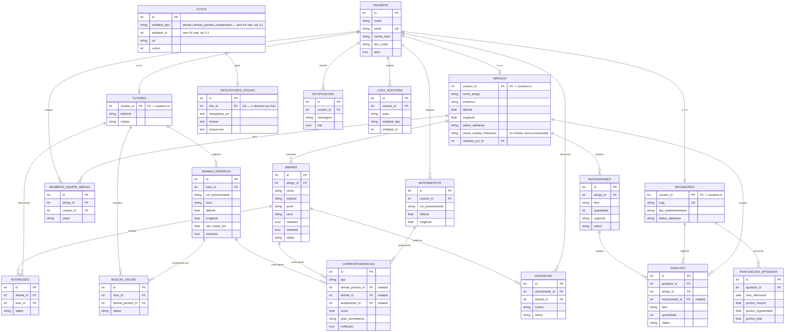

# 3. Modelo Entidade-Relacionamento (MER)

Modelo conceitual completo, cobrindo RF-01 a RF-41. Correspondência 1:1 com
`docs/schema.sql` (modelo relacional) e com `api/app/models/` (SQLAlchemy).

```mermaid
erDiagram
    USUARIOS ||--o| TUTORES : "é um"
    USUARIOS ||--o| ABRIGOS : "é um"
    USUARIOS ||--o| APOIADORES : "é um"
    USUARIOS ||--o{ MEMBROS_EQUIPE_ABRIGO : integra
    ABRIGOS ||--o{ MEMBROS_EQUIPE_ABRIGO : tem

    ABRIGOS ||--o{ ANIMAIS : cadastra
    ANIMAIS ||--o{ INTERESSES : recebe
    TUTORES ||--o{ INTERESSES : demonstra
    ANIMAIS ||--o{ DENUNCIAS : "pode ter"
    USUARIOS ||--o{ DENUNCIAS : denuncia

    TUTORES ||--o{ ANIMAIS_PERDIDOS : registra
    USUARIOS ||--o{ AVISTAMENTOS : registra
    TUTORES ||--o{ BUSCAS_SALVAS : mantém
    ANIMAIS_PERDIDOS ||--o{ BUSCAS_SALVAS : "monitorada em"

    ANIMAIS_PERDIDOS ||--o{ CORRESPONDENCIAS : "pode gerar"
    ANIMAIS ||--o{ CORRESPONDENCIAS : "pode gerar"
    AVISTAMENTOS ||--o{ CORRESPONDENCIAS : "pode gerar"

    FOTOS ||--o| DESCRITORES_VISUAIS : gera

    ABRIGOS ||--o{ NECESSIDADES : publica
    NECESSIDADES ||--o{ DOACOES : recebe
    APOIADORES ||--o{ DOACOES : registra
    ABRIGOS ||--o{ DOACOES : recebe
    APOIADORES ||--o{ PONTUACOES_APOIADOR : acumula

    USUARIOS ||--o{ NOTIFICACOES : recebe
    USUARIOS ||--o{ LOGS_AUDITORIA : realiza

    USUARIOS {
        int id PK
        string nome
        string email UK
        string senha_hash
        string tipo_conta
        bool ativo
    }
    TUTORES {
        int usuario_id PK "FK -> usuarios.id"
        string telefone
        string cidade
    }
    ABRIGOS {
        int usuario_id PK "FK -> usuarios.id"
        string nome_abrigo
        string endereco
        float latitude
        float longitude
        string status_validacao
        string chave_doacao_financeira "só exibida, nunca processada"
        int validado_por_id FK
    }
    MEMBROS_EQUIPE_ABRIGO {
        int id PK
        int abrigo_id FK
        int usuario_id FK
        string papel
    }
    APOIADORES {
        int usuario_id PK "FK -> usuarios.id"
        string cnpj UK
        string tipo_estabelecimento
        string status_validacao
    }
    ANIMAIS {
        int id PK
        int abrigo_id FK
        string nome
        string especie
        string porte
        string sexo
        bool castrado
        bool vacinado
        string status
    }
    FOTOS {
        int id PK
        string entidade_tipo "animal | animal_perdido | avistamento — sem FK real, ver 3.1"
        int entidade_id "sem FK real, ver 3.1"
        string url
        int ordem
    }
    INTERESSES {
        int id PK
        int animal_id FK
        int tutor_id FK
        string status
    }
    ANIMAIS_PERDIDOS {
        int id PK
        int tutor_id FK
        string cor_predominante
        string sexo
        float latitude
        float longitude
        float raio_busca_km
        bool resolvido
    }
    AVISTAMENTOS {
        int id PK
        int usuario_id FK
        string cor_predominante
        float latitude
        float longitude
    }
    DESCRITORES_VISUAIS {
        int id PK
        int foto_id FK "UK — 1 descritor por foto"
        text histograma_cor
        text textura
        text proporcoes
    }
    BUSCAS_SALVAS {
        int id PK
        int tutor_id FK
        int animal_perdido_id FK
        string status
    }
    CORRESPONDENCIAS {
        int id PK
        string tipo
        int animal_perdido_id FK "nullable"
        int animal_id FK "nullable"
        int avistamento_id FK "nullable"
        float score
        string grau_semelhanca
        bool notificado
    }
    NECESSIDADES {
        int id PK
        int abrigo_id FK
        string item
        int quantidade
        string urgencia
        string status
    }
    DOACOES {
        int id PK
        int apoiador_id FK
        int abrigo_id FK
        int necessidade_id FK "nullable"
        string item
        int quantidade
        string status
    }
    PONTUACOES_APOIADOR {
        int id PK
        int apoiador_id FK
        date mes_referencia
        float pontos_volume
        float pontos_regularidade
        float pontos_total
    }
    NOTIFICACOES {
        int id PK
        int usuario_id FK
        string mensagem
        bool lida
    }
    DENUNCIAS {
        int id PK
        int denunciante_id FK
        int animal_id FK
        string motivo
        string status
    }
    LOGS_AUDITORIA {
        int id PK
        int usuario_id FK
        string acao
        string entidade_tipo
        int entidade_id
    }
```

_Imagem gerada a partir do bloco Mermaid acima — usar esta versão ao colar no Word/Google Docs, que não renderizam Mermaid nativamente._

> **Correção (revisão cruzada com o diagrama de classes):** `chave_doacao_financeira` existia na classe `Abrigo` mas tinha ficado de fora daqui — esquecimento na hora de transcrever. Vale lembrar a regra já registrada: essa chave é **só exibida** (tipo PIX manual), a plataforma nunca processa pagamento por ela (não confundir com a seção 10 do escopo, "fora do escopo: pagamento dentro da plataforma").

## 3.1 Decisões de modelagem que exigem explicação

**Contas por tipo (table-per-type), não uma tabela única com colunas opcionais.**
`USUARIOS` guarda só o que é comum a todo mundo (autenticação). `TUTORES`,
`ABRIGOS` e `APOIADORES` têm PK = FK para `usuarios.id`. Alternativa
descartada: uma tabela `usuarios` única com todas as colunas de todos os
perfis — geraria dezenas de colunas `NULL` para quem não é abrigo, por
exemplo, e dificultaria constraint de obrigatoriedade por perfil.

**`FOTOS` é uma associação polimórfica** — pertence a um `ANIMAIS`, um
`ANIMAIS_PERDIDOS` ou um `AVISTAMENTOS`, indicado por `entidade_tipo` +
`entidade_id`, sem chave estrangeira de banco de fato (não é possível uma FK
apontar para "uma dentre três tabelas" em SQL padrão). Alternativa
descartada: três tabelas quase idênticas (`FOTOS_ANIMAL`, `FOTOS_PERDIDO`,
`FOTOS_AVISTAMENTO`) — foi rejeitada porque a extração de descritores (RF-21)
processa foto por foto de forma idêntica não importa a origem, e triplicar a
tabela obrigaria triplicar essa lógica ou fazer três JOINs onde um bastaria.
A integridade referencial dessa coluna é garantida na camada de aplicação
(backend), não pelo banco — trade-off assumido conscientemente.

**`CORRESPONDENCIAS` centraliza os três gatilhos de match** (busca do tutor,
alerta ao abrigo, busca inversa — escopo, seção 4) numa única tabela, com as
três FKs de destino sendo opcionais (só uma é preenchida por linha, a
depender de `tipo`). Isso evita reimplementar "o que é um grau de
semelhança" três vezes. A regra "preenche `animal_id` OU `avistamento_id`,
nunca os dois, nunca nenhum" não existe como constraint do banco, só como
regra que o código precisa respeitar — vale um teste automatizado específico
cobrindo isso, já que é fácil um bug deixar os dois nulos ou os dois
preenchidos sem ninguém perceber.

**`PONTUACOES_APOIADOR` é uma tabela de cache/resumo**, não a fonte de
verdade (que são as linhas de `DOACOES` confirmadas). Existe para não
recalcular o ranking inteiro a cada requisição — é recalculada a cada
confirmação de doação, uma linha por apoiador por mês, permitindo os "dois
períodos" do escopo (destaque do mês = uma linha; acumulado do ano = soma
das linhas do ano).
